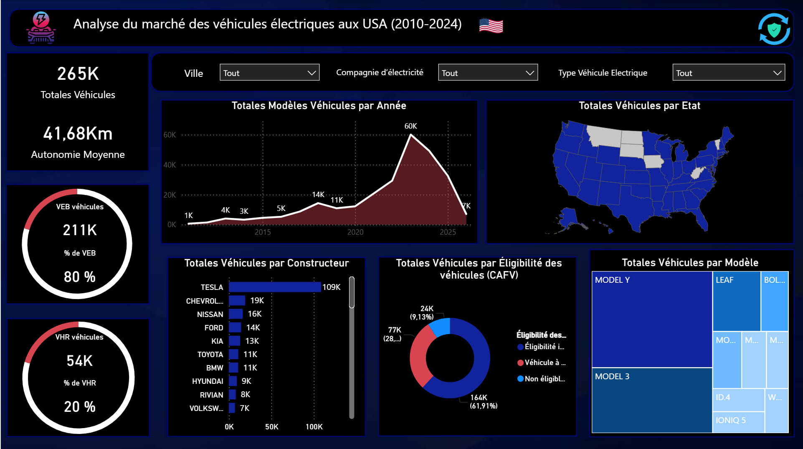

# ⚡ Analyse du Marché des Véhicules Électriques aux USA (2010-2024)

## 📊 Présentation du Projet
Ce tableau de bord Power BI offre une analyse complète de l'évolution du parc de véhicules électriques aux États-Unis. Il permet de comprendre la transition énergétique à travers les volumes de ventes, l'autonomie moyenne des véhicules et la domination des différents constructeurs sur le marché.

---

## 🛠️ Stack Technique
*   **Outil BI :** Power BI Desktop
*   **Visualisation :** Design personnalisé (Dark Mode)
*   **Analyses :** Distribution géographique, segmentation par modèle et constructeur.
*   **Données :** Historique 2010-2024 (Volumes, Autonomie, Éligibilité CAFV).

---

## 🖼️ Aperçu du Rapport

---

## 🔍 Points Clés de l'Analyse

### 1. Indicateurs Globaux (KPIs)
*   **Volume Total :** 265 000 véhicules analysés.
*   **Mix Énergétique :** Une forte domination des **VEB (Véhicules Électriques à Batterie)** à 80% contre 20% pour les **VHR (Véhicules Hybrides Rechargeables)**.
*   **Autonomie :** Une autonomie moyenne affichée de 41,68 km (basée sur l'ensemble du parc).

### 2. Tendances & Constructeurs
*   **Domination de Marché :** **Tesla** arrive largement en tête avec 109 000 véhicules, suivi par Chevrolet et Nissan.
*   **Modèles Phares :** Le Treemap met en avant la popularité massive des **Model Y** et **Model 3**.
*   **Évolution Temporelle :** Le graphique en aires montre une accélération exponentielle des immatriculations à partir de 2020, avec un pic notable autour de 2023 (60K modèles).

### 3. Éligibilité & Géographie
*   **Critères CAFV :** Plus de 61% des véhicules sont éligibles aux aides gouvernementales (Clean Alternative Fuel Vehicle).
*   **Répartition spatiale :** Une carte interactive permettant de filtrer les données par État et par ville.

---

## ⚡ Fonctionnalités UX
*   **Filtres dynamiques :** Segmentation par Ville, Compagnie d'électricité et Type de véhicule.
*   **Design Moderne :** Interface sombre optimisée pour la lecture de données complexes.
*   **Bouton de réinitialisation :** Navigation fluide pour revenir à la vue globale en un clic.

---

## 👤 Contact
Sébastien Henique - Data Analyst
*   LinkedIn : www.linkedin.com/in/sebastien-henique-data-analyst
